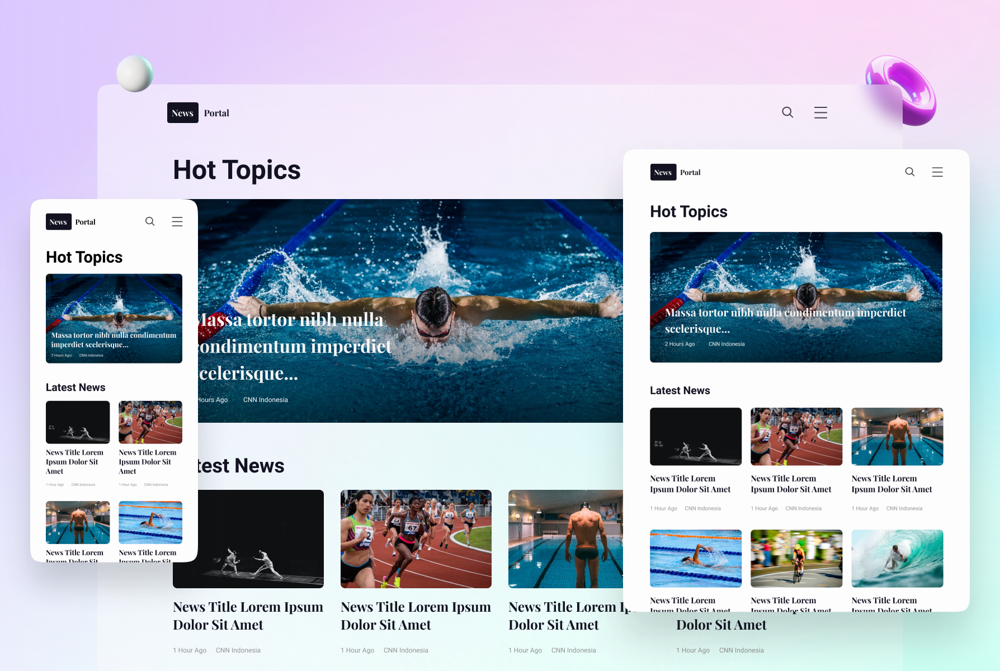

# NewsPortal

  

## Overview

Welcome to the News Portal project! This project aims to provide users with a powerful and intuitive search experience, allowing them to find information quickly and efficiently. Whether you're looking for web pages, images, documents, or more, our portal has got you covered.

## Feedback

Have feedback or suggestions? Feel free to [create an issue](https://github.com/viniciusnevescosta/news-portal/issues).

### License
This project is under the MIT license. See the [file](LICENSE) for more details.
